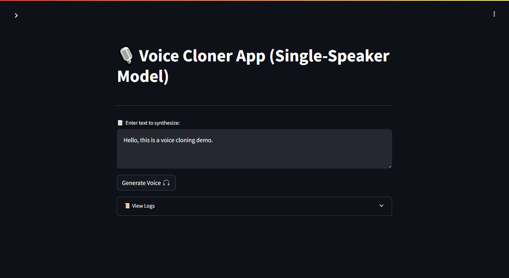
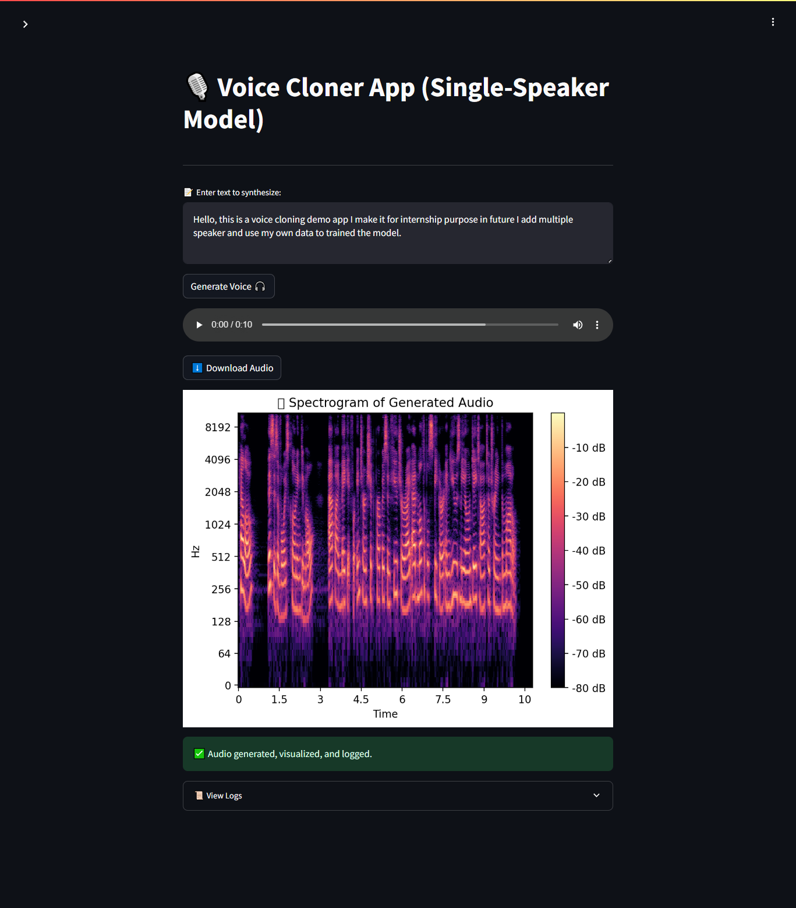

# 🎙️ Custom AI Voice Cloner & Text-to-Speech Generator

This is my internship project that demonstrates how to build an AI-based voice cloning and text-to-speech (TTS) application using pre-trained Coqui TTS models.

---

## ✅ Features

- 🔊 **Pretrained TTS Model:** Uses `tts_models/en/ljspeech/tacotron2-DDC` (single-speaker)  
- 📝 **Convert any input text to speech**  
- 📥 **Download the generated audio**  
- 📊 **Visualize the spectrogram of the audio**  
- 🧾 **Auto-log each generation with timestamp**  

---

## 🚀 How to Run Locally

### 1. Clone the Repository

```bash
git clone https://github.com/MAhsaanUllah/Voice-Cloner-Project.git
cd Voice-Cloner-Project

2. Create Virtual Environment (Recommended)

# Windows
python -m venv venv
venv\Scripts\activate

# macOS/Linux
python3 -m venv venv
source venv/bin/activate


3. Install Requirements

pip install -r requirements.txt

4. Run the App

streamlit run app.py

🌐 Optionally Host with ngrok
To make your app accessible via a temporary public link:

ngrok config add-authtoken YOUR_NGROK_TOKEN
streamlit run app.py
# Then in another terminal:
ngrok http 8501


📂 Project Structure

VOICE-CLONER-PROJECT/
├── app.py               # Streamlit app source code
├── requirements.txt     # Python dependencies
├── README.md            # Project documentation
├── .streamlit/          # Streamlit UI configs
├── logs/                # Log of each generation
├── output/              # Stores generated audio files
├── screenshots/         # Screenshots of the app
└── .gitignore           # Prevents committing secrets, logs, outputs, etc.


💡 Notes
🗣️ Currently uses a single-speaker Coqui TTS model

🚫 Some platforms (e.g., Streamlit Cloud, Hugging Face Spaces) may fail due to espeak-ng backend issues

🔐 Your secrets (e.g., ngrok token) are protected via .gitignore

🔮 Future Upgrades
🎙️ Multi-speaker support

🧠 Train on your own voice dataset

☁️ Deploy on Streamlit Cloud or Hugging Face (Docker)

🧠 Tech Stack
Python

Coqui TTS

Streamlit

Librosa

Matplotlib

📸 Screenshots
UI


Output



🙋 Author
Made with ❤️ by Ahsaan Ullah

